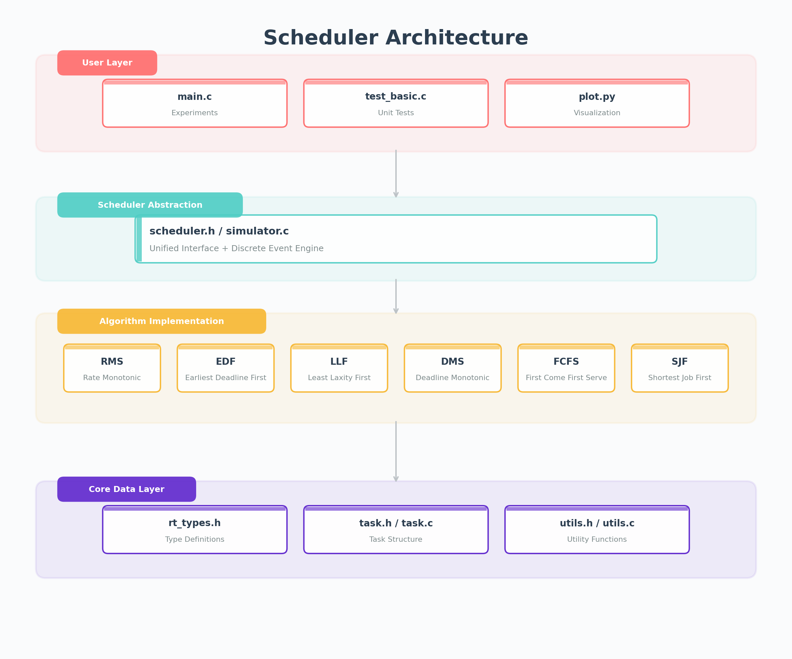

# Real-Time Scheduling System Design

## 1. System Architecture



## 2. Core Design Decisions

### 2.1 Scheduler Polymorphism

Since C does not support OOP, this project uses **function pointer structs (vtables)** for scheduler polymorphism:

```c
typedef struct SchedulerOps {
    const char* name;
    bool        preemptive;
    void (*init_priorities)(TaskSet* ts);
    int  (*select_next)(TaskSet* ts, double current_time);
    // ... callbacks
} SchedulerOps;
```

Each algorithm implements a `SchedulerOps` instance. The simulation engine calls through the unified interface without knowing the specific algorithm.

### 2.2 Discrete Event Simulation Engine

Uses **fixed time-step** discrete event simulation:

1. Check for new task arrivals
2. Check for deadline misses
3. Scheduling decision (call select_next)
4. Context switch (if needed)
5. Execute one time step
6. Advance time

Advantages: Simple implementation, strong controllability, easy event recording.

### 2.3 Memory Management Strategy

- Task sets: Stack allocation (fixed max 64 tasks)
- Event records: Fixed arrays inside structs (max 2000)
- Result returns: Value return (C99 struct value passing)

## 3. Module Dependencies

```
main.c          -> scheduler.h, task.h
simulator.c     -> scheduler.h, task.h
analysis.c      -> scheduler.h, task.h
task.c          -> task.h, rt_types.h
utils.c         -> utils.h, rt_types.h
schedulers/*.c  -> scheduler.h, task.h
test_basic.c    -> scheduler.h, task.h, utils.h
```

## 4. Extensibility Design

Adding a new scheduling algorithm requires only:
1. Create `src/schedulers/xxx.c`
2. Implement the `SchedulerOps` interface
3. Add to the scheduler array in `main.c`
4. No modifications to the simulation engine needed

## 5. Key Algorithm Complexity

| Operation | Time Complexity | Note |
|-----------|-----------------|------|
| Scheduling decision | O(n) | Traverse ready queue |
| RMS bound test | O(n) | Summation |
| RMS-RTA | O(n^2 * iter) | Iterative convergence |
| EDF density test | O(n) | Summation |
| EDF-PDC | O(k * n) | k = number of critical time points |
